# Mega-Zero-Heated-Bed
### This guide was the full process I went through to upgrade to a heated bed for the Anycubic Mega Zero. I have found some other guides online but I ran into a few problems while upgrading. 

### Thanks to [Adapted Machining for making this sweet video guide](https://www.youtube.com/watch?v=sJeAniMir0c&ab_channel=AdaptedMachining). As well as [ztipnis' heated bed guide](https://github.com/ztipnis/Mega-Zero-Heated-Bed) 

## Part List
- [Ultrabase (clone)](https://amzn.to/2YSLC1B)
- [Mosfet](https://amzn.to/3jCwgaK)
- [Boost Converter](https://amzn.to/2Z221Re)
- [Meanwell PSU](https://amzn.to/3d08vIx)
- [Optional: PSU Rocker Switch](https://amzn.to/3qmC4Il)
- [Red and Black Wire](https://amzn.to/3p8UHhe)
- [Heat Shrink](https://amzn.to/3rEb6fm)

As an Amazon Associate I earn from qualifying purchases

  

## 1. Update Firmware

There are two possible routes here. 
1) Update stock board firmware
2) Upgrade board

I chose option #1 as it seemed easier. If you choose option #2 you should probably look at the BigTreeTech SKR E3 Mini V1.2/V2 (not 100% these will both work). Below covers option 1.

#### 1.1 Download VS CODE

If you don't already have it, download [VS CODE](https://code.visualstudio.com/). 

#### 1.2 Install Plugins

The next step is to install 2 addons: 

1) Platformio
2) Auto Build Marlin

To do this click on the extensions tab on the left side of VS Code and search for each.

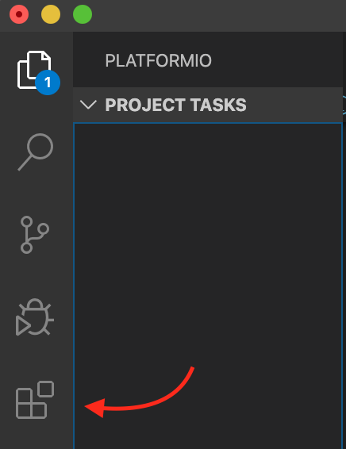

#### 1.3 Download Marlin

Now you want to head over to the [Marlin Github page](https://github.com/MarlinFirmware/Marlin) and download Marlin as well as the [Marlin Configurations](https://github.com/MarlinFirmware/Configurations)

Extract the Marlin folder and configurations folders. 

Find the config example folder based on your printer, in my case Anycubic Mega Zero. Open the folder labeled Anycubic V1 (if you chose option 2 open the BigTreeTech folder instead).

Unzip the Marlin folder and open up the sub folder called Marlin (it should look like this)

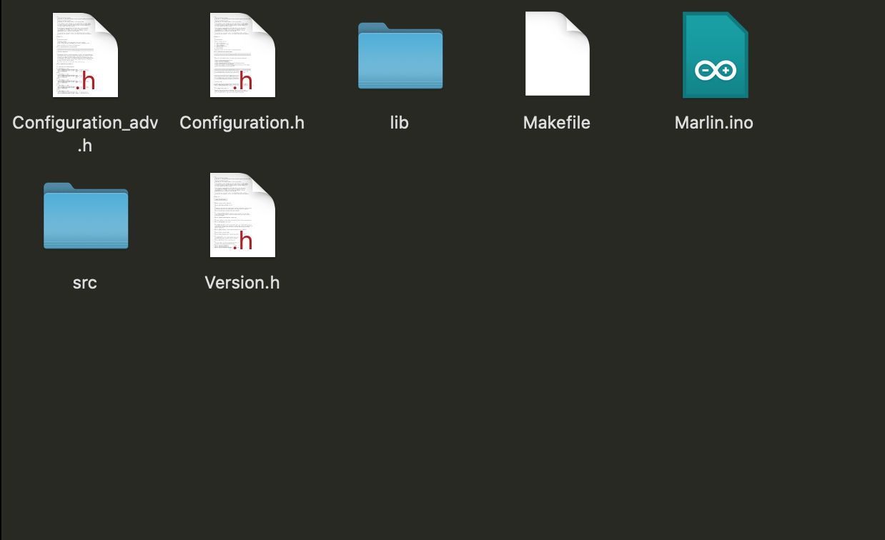

Now take the files from the example configuration and copy them into this folder. Say yes to replacing the files already in the folder.

#### 1.4 Import Project

Open the platformIO home extension on VS CODE.

Click Import Arduino Project.

Select Atmega1284p as the board and select the Marlin-2.0.x folder as the project directory.

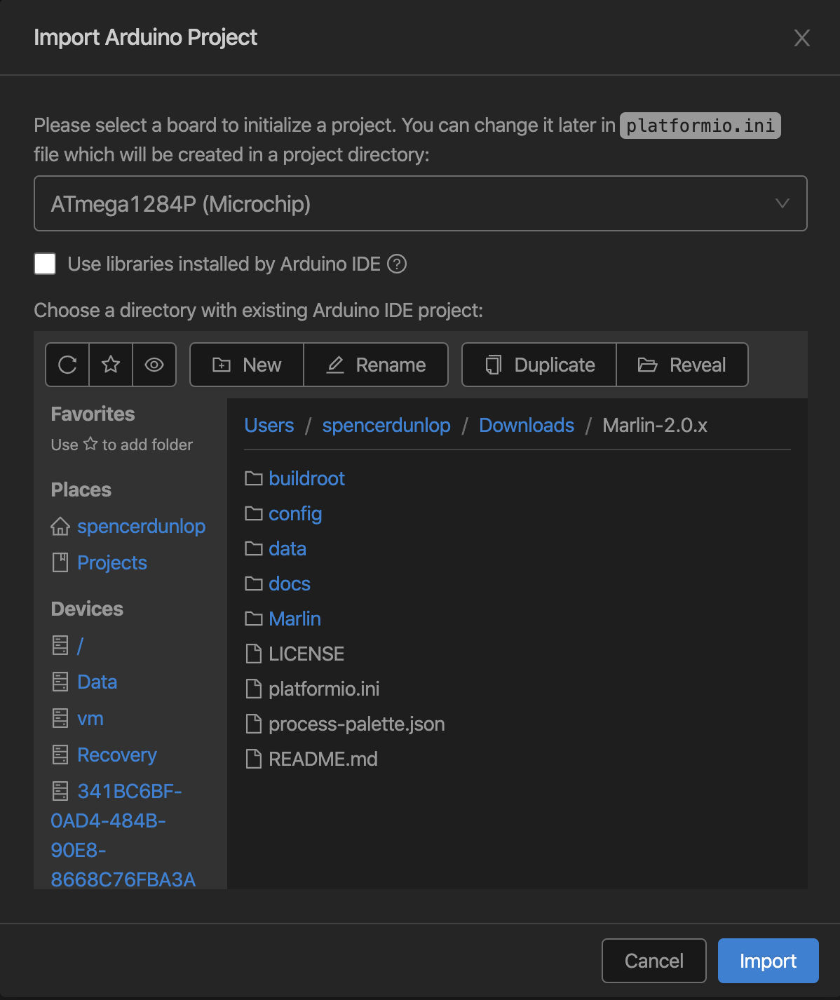

The configuration.h file should open.

Open platformIO Home again and click on the project tab on the left, click on configure in the project you just created.

Scroll down to default_envs and change the value from mega2560 to melzi, melzi_optiboot or melzi_optimized. I had to try all 3 as I kept getting an error using melzi.

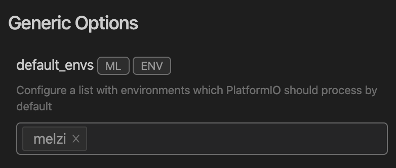
#### Go to the top of the page and hit save!

#### 1.5 Code Changes

There are a few changes I had to make to get the code to compile. 

Open the configuration.h file in the VS code explorer

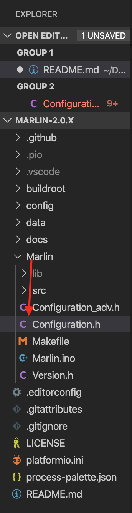

1) Comment line 94 
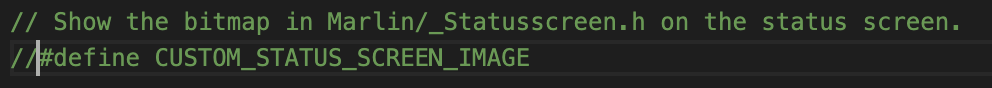
This custom status screen is the top left part of the lcd that says "Mega Zero". It was making the extruder and heat bed indicators overlap. You could probably figure out a way to keep it or change it. Here is what it looked like without uncommenting the custom status screen:
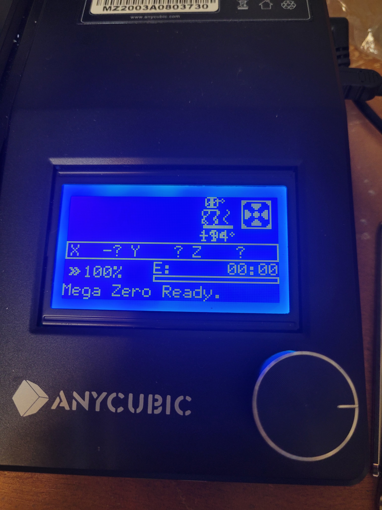

2) Change line 420 (TEMP_SENSOR_BED) to 1
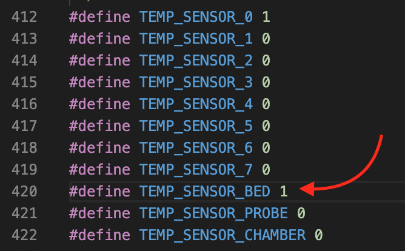
This enables the heated bed. 

3) Potential Problem: This was an issue for me, it might get updated in the future.

Under line 1503 add these lines:

#define HOMING_FEEDRATE_XY (50*60)

#define HOMING_FEEDRATE_Z (4*60)

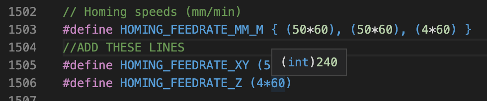

#### Compile and Upload

Now hit the check mark at the bottom left of VS CODE and if everything is right it should compile.

If that worked you can plug your computer into the printer and hit the upload button to the right of the checkmark.

I had a few issues that the bootloader was not responding, after trying several times turning the printer on and off and restarting my computer it magically worked. 

When you turn your printer on the status screen should look like this:
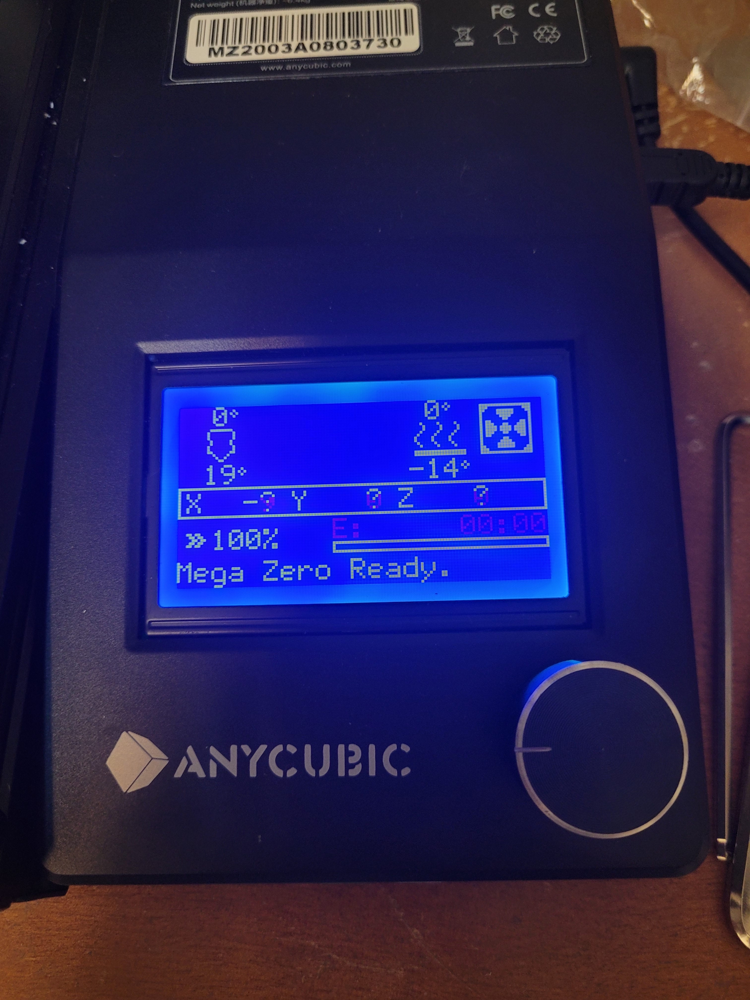
## 2. Electronics

Because the mainboard was not upgraded, you will have to add some electronics.

1) External MOSFET: Used to safely send power from a power supply to the heated bed. The MOSFET was removed from the MEGA ZEROS board :'(.
2) Powersupply: This is potentially the most expensive part in the list. There are a few options you can choose here. 

a) LED Powersupply. This is the powersupply most printers have. I would aim for a 12v 30 amp supply.

b) Xbox 360 Powersupply/Something lying around the house: This is the option I chose. I power my mainboard off of the powersupply that came with the Mega Zero and power the heated bed off of the Xbox power supply. Aim for a supply that can cover atleast 150 W(12V 12.5A). If you go this route, google how to convert an Xbox 360 power supply. (You will need heat shrink, solder and a soldering iron).

c) ATX Powersupply. There are ways of converting PC powersupplies to work with 3d printers. If you have an old one lying around here is a [good video](https://www.youtube.com/watch?v=5r-R3AgNJYc&ab_channel=ThomasSanladerer) talking about it.

3) 24 Gauge or lower wire : You can find a small roll of red and black wire on amazon for around $10.

4) Boost Converter: This will be used to increase the voltage coming off of the board to switch the MOSFET on.
#### You will need a multimeter to check the output from the boost converter.

5) 220x220 Heated bed: I chose to go with a knock off ultrabase from Amazon.

## 3. Mechanical

1) Bed adapters: Because of the placement of the stock bed screws, you will need an adapter to use the standard 220x220 heated bed. Designing one is not too hard just measure the stock screw distance and then the new bed screw distance and 3d print out of PLA for now (I have PLA on my printer now and haven't noticed any warping). In the future I am planning on making them out of aluminum.

2) Bed leveling knobs: The vertical extrusions are not wide enough to use the stock leveling knobs so I printed some off of thingiverse. [Here is the one I chose](https://www.thingiverse.com/thing:2138298). 

## 4. Assembly

1) Print the bed leveling knobs and bed adapters before removing the stock bed.
2) Solder wires to VIN of the boost converter. 
3) Solder the included wires from the MOSFET to the VOUT side.
4) Solder the boost connector VIN wires to the mainboard in this location: 

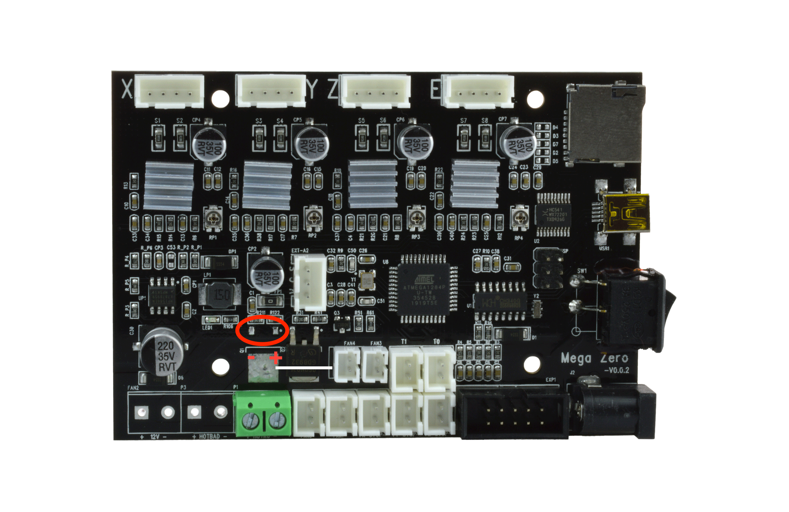

5) Using a multimeter tune the boost converter to have an output of >5V. The MOSFET will trigger from a signal of 5-24V.

6) Plug the output of the boost converter into the MOSFET at the connector labeled SIG GND. I did not try the board control connector so I don't know if that works also. 

7) Remove the stock bed by turning the bed level screws clockwise until they fall off. When all are off remove the stock bed. Be careful that you don't lose the springs.

8) Attach the bed adapter.

9) Attach the heated bed using the new leveling knobs you printed in the first step. Tighten the bed all the way down. You will need to move the z endstop a lot higher to account for the height you added with the bracket. In my case my bracket was 5mm tall so my z endstop only has one screw holding it in place. I will print a new bracket for it in the future.

10) Connect the heated bed wires to the MOSFET and mainboard. 

The thermistor wires are green and blue, there is a connector on the mainboard for it. The connector fits in nice and you can connect it and it probably will not come out. If you want to be sure you can use some hot glue to hold it down.

Connect the red and black wires of the bed to the screw terminal of the MOSFET labeled HEAT BED

11) Connect your power supply to the other screw terminal.

## 5. Testing

Turn your machine on and you should find the heated bed giving an ambient temperature reading (not -14). To make sure it is heating preheat the bed for PLA. If it is not heating after about 20 seconds your printer will start beeping at you.

--------
### Let me know if I have missed anything and I will add it! Hope this helps.

